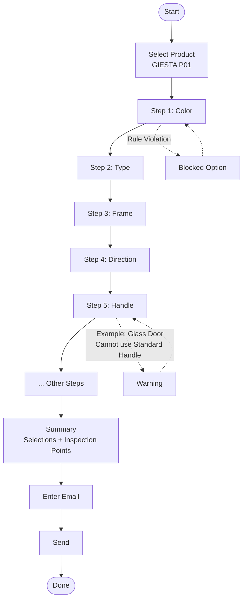
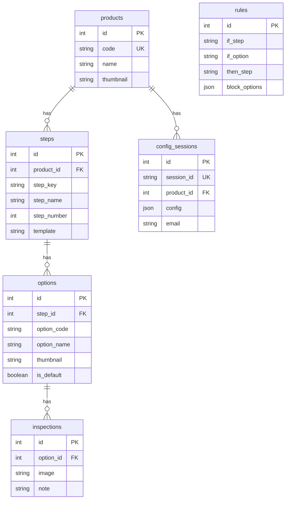

# Door Configuration System

ระบบ Configuration ประตู POC - เลือก spec ประตูพร้อมจุดตรวจสอบ แล้วส่งข้อมูลทาง email

## System Flow 



## Tech Stack

- Laravel 12
- MySQL 8
- Tailwind CSS
- PHP 8.2

## Database Schema



## Database Tables Explained

### 1. **products** - สินค้า
เก็บข้อมูลสินค้าหลัก (เช่น GIESTA P01)
- `code`: รหัสสินค้า (GIESTA-P01)
- `name`: ชื่อสินค้า
- `thumbnail`: รูปสินค้า

### 2. **steps** - ขั้นตอนการ Config
เก็บขั้นตอนการเลือก แต่ละสินค้ามีหลาย step
- `step_key`: รหัสขั้นตอน (color, type, frame)
- `step_name`: ชื่อที่แสดง (Color, Type, Frame Type)
- `step_number`: ลำดับขั้นตอน (1, 2, 3...)
- `template`: รูปแบบ UI (grid, list, visual)

**ตัวอย่าง:**
```
Step 1: Color (template: grid)
Step 2: Type (template: list)
Step 3: Frame (template: visual)
```

### 3. **options** - ตัวเลือกในแต่ละ step
เก็บตัวเลือกที่ให้เลือกในแต่ละขั้นตอน
- `option_code`: รหัสตัวเลือก (CREA_MOCHA, GRAY)
- `option_name`: ชื่อที่แสดง (Crea Mocha, Gray)
- `is_default`: เป็นค่า default หรือไม่

**ตัวอย่าง:**
```
Step: Color
  - Option: CREA_MOCHA (Crea Mocha)
  - Option: GRAY (Gray)
  - Option: WHITE (White)
```

### 4. **inspections** - จุดตรวจสอบ
เก็บรูปภาพจุดตรวจสอบสำหรับแต่ละ option
- `image`: path รูปภาพ
- `note`: คำอธิบาย (ตรวจสอบ Label สี, วัดความสูง)

**ตัวอย่าง:**
```
Option: CREA_MOCHA
  - Inspection: /images/inspect/color-label.jpg (ตรวจสอบ Label สี)
  - Inspection: /images/inspect/color-surface.jpg (ตรวจผิวสี)
```

### 5. **rules** - กฎความเข้ากัน
เก็บกฎว่า option ไหนเลือกคู่กันไม่ได้
- `if_step` + `if_option`: ถ้าเลือกสิ่งนี้
- `then_step`: จะมีผลกับ step นี้
- `block_options`: จะบล็อก options เหล่านี้ (JSON array)

**ตัวอย่าง:**
```json
{
  "if_step": "type",
  "if_option": "OUT_SWING",
  "then_step": "type",
  "block_options": ["IN_SWING_SILL"]
}
```
หมายความว่า: ถ้าเลือก OUT_SWING แล้ว จะเลือก IN_SWING_SILL ไม่ได้

### 6. **config_sessions** - บันทึกการ Config
เก็บประวัติการเลือกของแต่ละ session
- `session_id`: รหัส session (CONF-ABC123)
- `config`: JSON เก็บการเลือกทั้งหมด
- `email`: อีเมลที่ส่งไป

**ตัวอย่าง:**
```json
{
  "session_id": "CONF-XYZ789",
  "config": {
    "color": "CREA_MOCHA",
    "type": "IN_SWING_SILL",
    "frame_type": "SINGLE",
    "movement": "LEFT"
  },
  "email": "customer@example.com"
}
```

## Data Flow Example

```
1. User เลือกสินค้า GIESTA-P01 (products)
   ↓
2. ระบบโหลด Step 1: Color (steps)
   ↓
3. แสดงตัวเลือก: Crea Mocha, Gray, White (options)
   ↓
4. User เลือก "Gray"
   → ระบบเช็ค rules ว่ามี option ไหนถูกบล็อกไหม
   ↓
5. ไปขั้นตอนต่อไป Step 2: Type
   ↓
6. ... ทำต่อจนครบทุก step
   ↓
7. หน้า Summary: แสดงการเลือกทั้งหมด + inspections
   ↓
8. User กรอกอีเมล → บันทึกใน config_sessions → ส่งเมล
```

## Installation

### Development (Mac/Local)

```bash
# Clone
git clone https://github.com/Jedsadha1777/door-config.git
cd door-config

# Install dependencies
composer install

# Setup environment
cp .env.example .env
php artisan key:generate

# Database
php artisan migrate:fresh --seed

# Run
php artisan serve
```

Access: http://localhost:8000

### Production (Docker)

**docker-compose.yml**

```yaml
version: '3.8'

services:
  app:
    build:
      context: .
      dockerfile: Dockerfile
    ports:
      - "8080:80"
    environment:
      - DB_HOST=db
      - DB_DATABASE=door_config
      - DB_USERNAME=laravel
      - DB_PASSWORD=secret
    depends_on:
      - db
    volumes:
      - ./storage:/var/www/html/storage

  db:
    image: mysql:8.0
    environment:
      MYSQL_DATABASE: door_config
      MYSQL_USER: laravel
      MYSQL_PASSWORD: secret
      MYSQL_ROOT_PASSWORD: root
    volumes:
      - dbdata:/var/lib/mysql

volumes:
  dbdata:
```

**Dockerfile**

```dockerfile
FROM php:8.2-apache

# Install dependencies
RUN apt-get update && apt-get install -y \
    git curl zip unzip \
    libpng-dev libjpeg-dev libfreetype6-dev \
    && docker-php-ext-configure gd --with-freetype --with-jpeg \
    && docker-php-ext-install pdo pdo_mysql gd

# Enable Apache mod_rewrite
RUN a2enmod rewrite

# Set working directory
WORKDIR /var/www/html

# Copy project
COPY . .

# Install Composer
COPY --from=composer:latest /usr/bin/composer /usr/bin/composer
RUN composer install --no-dev --optimize-autoloader

# Set permissions
RUN chown -R www-data:www-data /var/www/html/storage /var/www/html/bootstrap/cache
RUN chmod -R 775 /var/www/html/storage /var/www/html/bootstrap/cache

# Apache config
COPY docker/vhost.conf /etc/apache2/sites-available/000-default.conf

EXPOSE 80
CMD ["apache2-foreground"]
```

**docker/vhost.conf**

```apache
<VirtualHost *:80>
    DocumentRoot /var/www/html/public

    <Directory /var/www/html/public>
        AllowOverride All
        Require all granted
    </Directory>

    ErrorLog ${APACHE_LOG_DIR}/error.log
    CustomLog ${APACHE_LOG_DIR}/access.log combined
</VirtualHost>
```

**Deploy Steps**

```bash
# Build & Run
docker-compose up -d

# Setup database
docker-compose exec app php artisan migrate:fresh --seed

# Access
http://localhost:8080
```

## Features

- Multi-step configuration wizard
- Compatibility rules (auto-block incompatible options)
- Multiple template styles (grid, list, visual)
- Inspection points with images
- Email summary with configuration details
- Session-based configuration tracking

## License

MIT