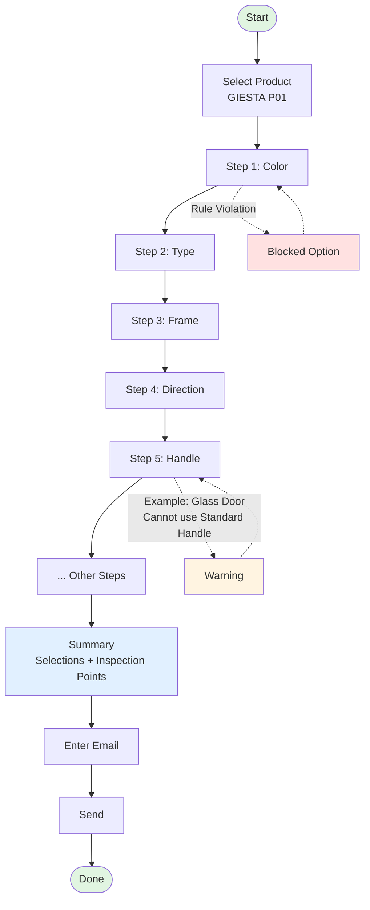
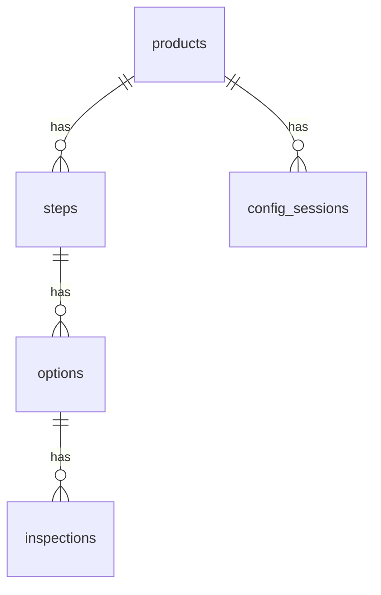

# Door Configuration System

ระบบ Configuration ประตู POC - เลือก spec ประตูพร้อมจุดตรวจสอบ แล้วส่งข้อมูลทาง email

## System Flow 



## Tech Stack

- Laravel 12
- MySQL 8
- Tailwind CSS
- PHP 8.2

## Installation

### Development (Mac/Local)

```bash
# Clone
git clone https://github.com/Jedsadha1777/door-config.git
cd door-config

# Install dependencies
composer install

# Setup environment
cp .env.example .env
php artisan key:generate

# Database
php artisan migrate:fresh --seed

# Run
php artisan serve
```

Access: http://localhost:8000

### Production (Docker)

**docker-compose.yml**

```yaml
version: '3.8'

services:
  app:
    build:
      context: .
      dockerfile: Dockerfile
    ports:
      - "8080:80"
    environment:
      - DB_HOST=db
      - DB_DATABASE=door_config
      - DB_USERNAME=laravel
      - DB_PASSWORD=secret
    depends_on:
      - db
    volumes:
      - ./storage:/var/www/html/storage

  db:
    image: mysql:8.0
    environment:
      MYSQL_DATABASE: door_config
      MYSQL_USER: laravel
      MYSQL_PASSWORD: secret
      MYSQL_ROOT_PASSWORD: root
    volumes:
      - dbdata:/var/lib/mysql

volumes:
  dbdata:
```

**Dockerfile**

```dockerfile
FROM php:8.2-apache

# Install dependencies
RUN apt-get update && apt-get install -y \
    git curl zip unzip \
    libpng-dev libjpeg-dev libfreetype6-dev \
    && docker-php-ext-configure gd --with-freetype --with-jpeg \
    && docker-php-ext-install pdo pdo_mysql gd

# Enable Apache mod_rewrite
RUN a2enmod rewrite

# Set working directory
WORKDIR /var/www/html

# Copy project
COPY . .

# Install Composer
COPY --from=composer:latest /usr/bin/composer /usr/bin/composer
RUN composer install --no-dev --optimize-autoloader

# Set permissions
RUN chown -R www-data:www-data /var/www/html/storage /var/www/html/bootstrap/cache
RUN chmod -R 775 /var/www/html/storage /var/www/html/bootstrap/cache

# Apache config
COPY docker/vhost.conf /etc/apache2/sites-available/000-default.conf

EXPOSE 80
CMD ["apache2-foreground"]
```

**docker/vhost.conf**

```apache
<VirtualHost *:80>
    DocumentRoot /var/www/html/public

    <Directory /var/www/html/public>
        AllowOverride All
        Require all granted
    </Directory>

    ErrorLog ${APACHE_LOG_DIR}/error.log
    CustomLog ${APACHE_LOG_DIR}/access.log combined
</VirtualHost>
```

**Deploy Steps**

```bash
# Build & Run
docker-compose up -d

# Setup database
docker-compose exec app php artisan migrate:fresh --seed

# Access
http://localhost:8080
```

## Database Schema



## License

MIT